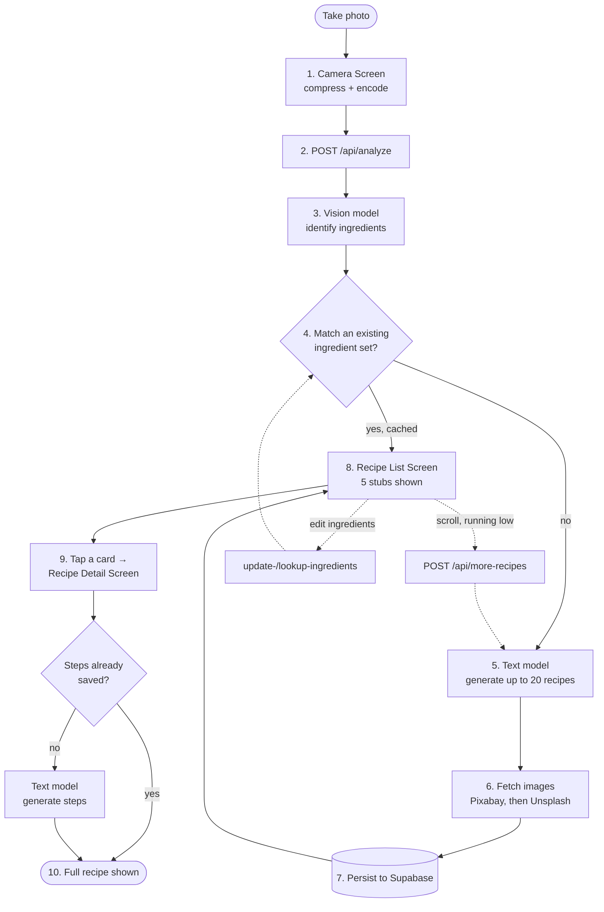

# Smart Recipe Planner

Photograph the ingredients you have. Get 5 structured, ready-to-cook recipes back — no chat window, no typing out a pantry list.

Built as an engineering take-home assignment (see [`Engineering Take-Home Assignment.pdf`](./Engineering%20Take-Home%20Assignment.pdf) for the original brief). All engineering work lives in [`smart-recipe-planner/`](./smart-recipe-planner).

**Live app:** smart-recipe-planner-2pgf3wru3-smart-recipes-projects.vercel.app
**Android Expo Build:** https://expo.dev/accounts/moonlit9349/projects/smart-recipe-planner/builds/35deec7e-708e-4d74-bf13-18eed03a71b6

## Contents

- [Product Demo — What, Why, Impact](#product-demo--what-why-impact)
- [Requirements](#requirements)
- [Constraints](#constraints)
- [Tech Stack](#tech-stack)
- [Architecture](#architecture)
- [Trade-offs \& Reasoning](#trade-offs--reasoning)
- [Productionizing / What's Next](#productionizing--whats-next)
- [Getting Started](#getting-started)
- [Personal Notes](#personal-notes-scratchpad-not-part-of-the-deliverable)

## Product Demo — What, Why, Impact

### What it does

- Point the camera at your ingredients — a vision model identifies what's there
- Get 5 structured recipe cards immediately (title, time, difficulty, cuisine) — not a wall of text
- Don't like the options? Refresh for 5 more, drawn from the same scan, never repeating
- Tap a card for the full recipe: ingredients + step-by-step instructions, generated on demand
- Missed something, or the model got it wrong? Add or remove ingredient tags and the recipe list updates around the corrected list

### Why this shape

- The brief explicitly calls for a **structured UI, not a chatbot** — every downstream decision (schema-constrained model output, card-based lists, lazy detail loading) exists to serve that constraint
- Ingredient-first, not recipe-search-first: it matches how people actually decide what to cook — "what do I have" comes before "what do I want"

### Business impact

- Removes the two biggest frictions in "what can I cook tonight": manually typing out a pantry list, and sifting through recipes that need four ingredients you don't have
- Structured, glanceable cards convert faster than a chat transcript — less reading, faster decision, which matters more on a phone than on desktop
- The caching/dedup work described below means the same photo — or a near-identical pantry — never re-pays the full generation cost. That's what makes "generate recipes with AI" viable as a real feature rather than a novelty that gets expensive on repeat users

## Requirements

### Functional (from the brief)

- Photograph ingredients → 5 recipes achievable with them
- Refresh → 5 new, non-repeating recipes drawn from the same scan
- Tap a recipe → full detail screen
- Structured UI, not a conversational one

### Non-functional (self-imposed)

- **Latency** — the real flow is camera → vision model → LLM → image lookup, which is a lot of network hops to hide; addressed with fast/cheap model tiers, lazy step generation, and background pagination top-ups instead of blocking scroll
- **Cost control** — never regenerate what's already been generated for the same, or a near-identical, ingredient set
- **Resilience** — a dark/blurry photo or a flaky model call should degrade gracefully, not crash the flow
- **Structural correctness** — recipe data must always match the shape the UI expects; no free-text parsing surprises

## Constraints

- Solo build on a take-home time budget — no dedicated infra/ops time
- Model and provider choice bounded by what's available through the Vercel AI Gateway
- Initial plan to use AWS Bedrock stalled on IAM credential approval turnaround; switched to a directly-keyed provider to stay unblocked
- Third-party image APIs are rate-limited on free tiers (Unsplash's demo tier: 50 requests/hour) — this shaped the image-sourcing strategy below
- One platform (Vercel) doing double duty as API host and static web host, backed by one managed Postgres (Supabase) — no separate backend infra to provision or operate

## Tech Stack

| Layer | Choice | Why |
|---|---|---|
| Mobile app | Expo / React Native (SDK 54, RN 0.81) | Cross-platform from one codebase; Expo's managed workflow + EAS covers camera access, image manipulation, and OTA updates without hand-rolling native modules |
| Navigation | React Navigation (native-stack) | Native-feeling stack transitions for a linear, 3-screen flow |
| Client state | TanStack Query + Zustand | Query owns server-state (fetch/cache/loading/error) per request; Zustand owns client-only state (pagination cursor, active filters) that Query isn't meant for |
| Backend | Vercel Serverless Functions (TypeScript) | Same platform hosts the API and the web export of the app — one deploy target, nothing extra to provision |
| Database | Supabase (Postgres + pgvector) | Relational data (recipes, ingredients) and vector similarity (fuzzy matching, diversity checks) in one managed service |
| AI orchestration | Vercel AI Gateway + AI SDK | One integration point for multiple model providers with built-in fallback; swapping a model is a one-line change in a single file |
| Images | Pixabay (primary) + Unsplash (fallback) | Pixabay's free tier comfortably supports per-recipe-title search; Unsplash fills the gaps it misses |

## Architecture

### Screen flow

```
Camera Screen  →  Recipe List Screen  →  Recipe Detail Screen
```

Matches the brief's required flow directly: capture → structured list → full detail on selection.

### Backend flow



Solid, numbered arrows are the main chronological path (1–10): take a photo, resolve or generate recipes, browse, open one. Dotted arrows are the two secondary loops (infinite-scroll top-up, and editing detected ingredients) that re-enter the same pipeline rather than starting a new story.

### Key design signals

- **Structured output over free text** — every model call is schema-constrained (Zod, via tool-calling) rather than parsed from prose. This is the single biggest reliability lever for putting an LLM behind a UI that can't tolerate malformed data.
- **Two-tier caching** — an exact fingerprint match (identical ingredient list) skips generation entirely; a fuzzy embedding match (cosine similarity > 0.92) catches near-duplicate scans (e.g. "egg, milk, flour" vs. "eggs, flour, milk") without re-generating.
- **Diversity filtering on generation, not just titles** — new recipe candidates are embedded and compared against everything already persisted for that ingredient set (similarity > 0.9 → dropped), catching same-dish-different-name repeats that a title-exclusion list alone would miss.
- **Lazy, persisted generation** — recipe steps/tips are generated only the first time a user opens that recipe, then written back. Most of the cost of "up to 20 recipes per scan" is metadata-only; full step generation happens only for recipes someone actually opens.
- **Hybrid pagination** — the client holds every stub fetched so far and serves it 5 at a time; the server tops up in the background once the buffer runs low, so scrolling rarely blocks on a live model call.

## Trade-offs & Reasoning

### Recipe generation volume & timing

Generating ~30 recipes upfront — even on a fast model — front-loaded 1–1.5 minutes of latency before the user saw anything, which is unacceptable for a first-run experience. Landed on generating a smaller initial batch and topping up on refresh/scroll instead.

- Cost of this choice: cuisine-tag filters only show tags already present in what's been generated so far, rather than letting a user request an arbitrary cuisine from a larger upfront pool.
- Considered pre-caching a wider spread of cuisines to compensate — dropped it; extra token spend and latency for a benefit most users won't use in one session.

### Vision model choice

A fast/non-reasoning-tier vision model, not a heavier segmentation-grade model (e.g. Meta SAM3-class). Ingredient identification is narrow structured extraction, not a task that benefits from segmentation-level precision or reasoning depth — the extra capability wouldn't change the output, only the cost and latency.

### No dietary/nutrition filtering

No vegetarian / gluten-free / calorie-target toggles. The ingredient list itself is already the dietary constraint — recipes are generated *from* what's in the photo, so a separate filter layer would duplicate a constraint that's already implicit. Cuisine tags cover the "narrow the list down" use case without the added surface area.

### Repetition control is heuristic, not guaranteed

Embedding-based diversity filtering (0.9 threshold) catches most same-dish repeats, but the threshold is an untuned starting point, not a validated value — a known soft spot, not a solved problem.

### Cards + refresh, not swipe

Considered a Tinder-style swipe interface to reduce the *feel* of latency between recipes. Rejected: the brief's model is "5 at a time, refresh for 5 more," which doesn't map cleanly onto a one-card-at-a-time swipe interaction — it would fight the spec rather than serve it.

### Lazy detail generation

Recipe steps are generated on first open and persisted, not generated upfront for every candidate — avoids paying generation cost for detail nobody reads.

### Image sourcing

Unsplash's free tier (50 requests/hour) isn't enough to give every recipe a unique image. Landed on Pixabay per-recipe-title search as primary, a cuisine-level query as fallback, and accepted some image reuse within a session rather than paying for a higher tier or serving broken images.

### No token streaming

Chose complete responses over streaming text. Streaming visibly signals "an AI is typing," which works against the brief's explicit "not a chat interface" requirement — a structured card UI reads better as a finished result than as a stream. The trade-off is a longer perceived wait before anything renders, mitigated by the caching and lazy-generation strategies above.

### Build vs. buy: LLM generation vs. a recipe API

Considered calling a third-party recipe API instead of generating with an LLM, to cut latency and cost. Rejected: a fixed recipe database can't creatively combine an arbitrary, possibly unusual ingredient list the way generation can, and it would make the product redundant with existing recipe sites — the generative angle is the actual differentiator.

## Productionizing / What's Next

### Would add before real users

- **Per-endpoint rate limiting** — not yet implemented. Proposed shape, reasoned by generation cost and abuse potential per endpoint:

  | Endpoint | Heavy legit session | Limit | Why |
  |---|---|---|---|
  | `POST /api/analyze` | 1–3 calls | 10 / 30 min | Priciest by far — vision model + up to 20 recipe generations + image lookups on a cache miss |
  | `POST /api/more-recipes` | 5–15 calls | 30 / 30 min | Triggers generation, but a smaller batch (10–15) and no vision call |
  | `POST /api/update-ingredients` | 2–5 calls | 20 / 30 min | Same generation path as analyze, smaller batch (10) |
  | `POST /api/lookup-ingredients` | 2–5 calls | 60 / 30 min | Read-only — an embedding call + DB read, no generation |
  | `GET /api/recipe` | 10–20 calls | 200 / 30 min | Most-frequent legit call (every card tap); generation fires once ever per recipe ID, so abuse potential is self-limiting |

- **Local caching of recipe images** — images are already reused within a set to cut generation cost; next step is caching already-loaded images client-side to cut *initial* load latency too
- **Hybrid model calling** for recipe generation — splitting generation across providers/tiers to shave more latency off the initial scan
- **Tune the two similarity thresholds** (0.92 fuzzy-match, 0.9 diversity) against real usage data instead of leaving them as untuned starting points
- **Run smaller vision models locally/on-device** — trading a one-time model-loading cost for zero marginal per-scan latency and cost
- **Deployment health checks** — while shipping this, a Vercel-side production build silently produced empty output (a "Ready" deployment serving 404s everywhere) with no error surfaced anywhere in the pipeline. A post-deploy smoke test (hit `/` and one known API route, fail the deploy if either doesn't respond correctly) would catch this class of failure automatically instead of discovering it in the field.

## Getting Started

All commands run from `smart-recipe-planner/`.

```bash
npm install
npx vercel env pull .env       # pulls Supabase / AI Gateway / image API keys

npx vercel dev                 # terminal 1 — serves api/*.ts on localhost:3000
npx expo start                 # terminal 2 — Metro bundler; EXPO_PUBLIC_API_URL defaults to localhost:3000

npm run web                    # fastest way to iterate in a browser
npm run build                  # tsc --noEmit — typecheck
```

`npx vercel dev` is the only supported way to run the API locally. See [`smart-recipe-planner/CLAUDE.md`](./smart-recipe-planner/CLAUDE.md) for the full architecture writeup this README summarizes.

---

## Personal Notes (scratchpad — not part of the deliverable)

Everything below is working notes to myself from building this — kept for my own reference, not polished for submission.

### Assignment brief

- **Smart Recipe Planner**

    You should build a mobile interface for this project using Expo.

    Users should be able to take a photo of ingredients and the app will show them a list of 5 recipes they can make with those ingredients. If they don't like any of those recipes, they can refresh and get 5 new recipes. The recipes should not repeat from refresh to refresh.

    Upon finding a recipe they like, the user should be able to click into one of the recipes from the list and get the full recipe in a new screen.

    This should not be a chat interface. The recipe list and the recipes themselves should be highly structured.

### Submission Instructions

---

1. **Videos:** unlisted YouTube videos, 10 to 20 min (must be at least 10 min), no scripts and be yourself. Walk us through the following sections:
    1. Product demo - what you built, why, and the business impact (this should be less than half the video)
    2. Tech stack - what you picked and why
    3. Architectural decisions - the high-level design and the signals behind it
    4. Technical trade-offs - what you chose not to do, and what you'd do to production-ize or improve the system
2. **Ashby Submission**
    1. Please use the Ashby submission link provided in the initial instructions. If you did not receive a submission link, please follow the instructions below.
        1. YouTube video links
        2. Link to a **public** GitHub repo with a clear README.md explaining how to run/test the code
        3. Deployed/live link


### Decisions
- Having trouble approving AWS bedrock IAM credentials so had to temporarily use a long term API key instead
- JSON output is forced using Zod schema instead of relying onn propmt. 
- Using base64 of image for 'UID' to cache image
- used fuzzy embedding match to match (1) identified ingredeients with past ingredients and (2) prevent duplication in recipe generations being displayed
    - 0.9 and 0.92 embedding threashold are arbitary
    - embeddings uses AI SDK cosine similarity instead of pgvector index
- added if "imagetoodark" check
- aborts API call from MORE-RECIPES if changing food tags 
- limit to 100 requests per 30 minutes

Structured outputs: Force the model to return strict JSON (recipe name, time, difficulty, ingredients with quantities, steps) via tool-calling/schema constraints rather than parsing free text — shows you understand reliability issues with LLMs.
Ingredient confidence/correction step: After photo analysis, show detected ingredients and let the user confirm/edit before generating recipes — handles vision-model errors gracefully instead of pretending it's perfect.
Smart exclusion for refresh: Instead of just avoiding repeats, use embeddings or a diversity constraint so refreshed recipes are meaningfully different in cuisine/style, not just different names for the same dish.
Caching/cost awareness: Cache ingredient→recipe results, discuss latency/cost trade-offs of vision + generation calls in your video — this hits the "trajectory of LLMs" angle they mention wanting to see.
Offline-friendly UX: Skeleton loading states, graceful handling of a bad photo (blurry, no food detected).


### Tradeoffs
- recipe generating 30 at once takes a long time even with sonnet 4.6. These are also predetermined genres of food. Instead let us generate around 10, upon refresh then we will generate 20. This will slow down UI, but the intial image analysis (which includes generating the recipe) should be reduced signcantly (currently all front loading takes around 1-1.5m)
    - used a lightweight model like grok, but still struggling
        - did away with pre-caching idea to cover more recipe diversity - unnecessary token usage + adding more latency
            - Instead changing to only showing tags that are available from initially generated 30 recipes

- removed the option to generate to select cuisine tags out of intiially genearted 30 options - assuming unlikely for user to want so many recipes at once
    - instead just showing available tags from the intiially generated 30 recipes

- Not using highly capable analysis model like Meta SAM3 because unnecessary and resource intensive

- Nutrition/dietary filtering: Structured toggles (vegetarian, gluten-free, calorie target) that constrain generation.
    - Instead doing cuisine tags as ingreidents available are likely to be limited by dietary limitation already

- generates recipes, but embedding whether it's too reptetative. 
- Considered tinder style swipe out of better UI, but primarily minimizing feel of latency when loading new recipes, however original steps require 5 cards at a time and 5 new cards for renewal
- generating detailed recipes after clicking to prevent upfront latency and unneccessary tokens
- unable to generate a lot of new unsplash images - so instead searched by cuisine tags w/ repeated images
- not using streaming of text to reduce feel of AI at the tradeoff of latency

- to reduce recipe loading latency, i could use a third party API to generate some recipes to save time and latency. However this would limit the more unique food combo options taht leverage more ingredients at once & redundant to existing online recipe websites


### future points of improvements
- run LLM locally 
- repeated images are used for some recipes to reduce API call, latency and image loading 
    - while locally loaded images are cache - trying to reduce latency for intial image pull
- consider hybrid API calling for recipes to reduce further latency
- implemenet more defined firewall rules specfic for vision to reduce constant expsnive hits - but grok costs for vision is pretty low 
    - currently at 10 requests/30 mins to call vision analyze function
    - ideally also recipes refresh limits
    - e.g.:

Endpoint	Heavy legit session	Limit	Why
POST /api/analyze	1–3 calls	10	Priciest by far — vision model + up to 20 recipe generations + image lookups on a cache miss
POST /api/more-recipes	5–15 calls	30	Triggers LLM generation, but a smaller batch (10–15) and no vision call
POST /api/update-ingredients	2–5 calls	20	Same generation path as analyze, smaller batch (10)
POST /api/lookup-ingredients	2–5 calls	60	Read-only — no generation, just an embedding call + DB read
GET /api/recipe	10–20 calls	200	Your most-frequent legit call (every card tap); generation only fires once ever per recipe ID, so abuse potential is naturally self-limiting
